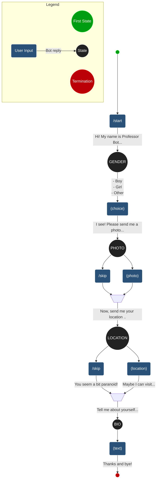

```mermaid
graph TD
    %% Documentation: https://mermaid-js.github.io/mermaid/#/flowchart
    firstState((" ")):::firstState --> A("/start"):::userInput 
    A -->|Hi! My name is Professor Bot...| B((GENDER)):::state
    B --> |"- Boy <br /> - Girl <br /> - Other"|C("(choice)"):::userInput 
    C --> |I see! Please send me a photo...| D((PHOTO)):::state
    D --> E("/skip"):::userInput
    D --> F("(photo)"):::userInput
    E --> G[\" "/]
    F --> G
    G --> |"Now, send me your location .."| H((LOCATION)):::state
    H --> I("/skip"):::userInput
    H --> J("(location)"):::userInput
    I --> |You seem a bit paranoid!| K[\" "/]
    J --> |Maybe I can visit...| K
    K --> |"Tell me about yourself..."| L(("BIO")):::state
    L --> M("(text)"):::userInput
    M --> |"Thanks and bye!"| termination((" ")):::termination

    subgraph Legend
    firstStateLegend(("First State")):::firstState
    terminationLegend(("Termination")):::termination
    Y(User Input):::userInput --> |"Bot reply"| Z((State)):::state
    end

    classDef userInput  fill:#2a5279, color:#ffffff, stroke:#ffffff
    classDef state fill:#222222, color:#ffffff, stroke:#ffffff
    classDef firstState fill:#009c11, stroke:#42FF57, color:#ffffff
    classDef termination fill:#bb0007, stroke:#E60109, color:#ffffff
```